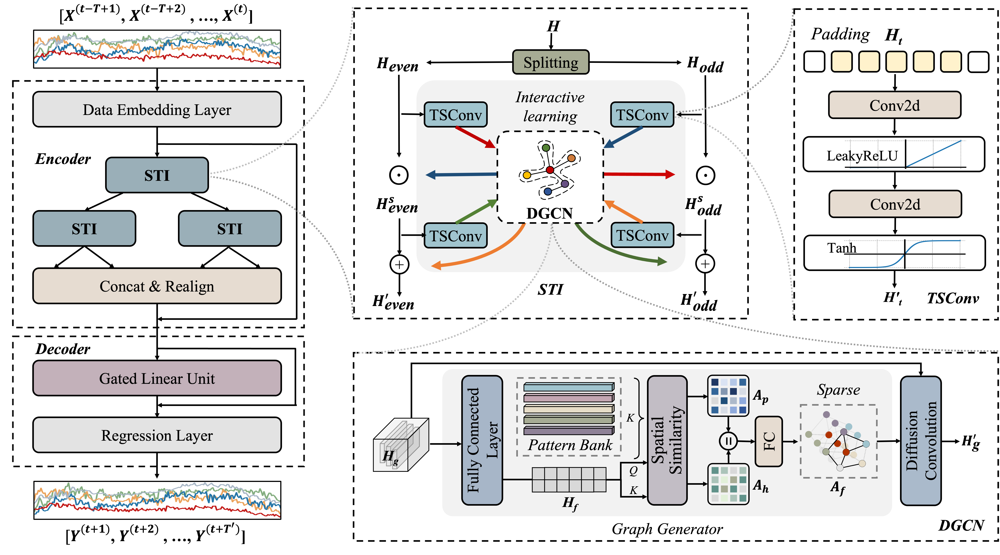

# STIDGCN
This is the pytorch implementation of STIDGCN. I hope these codes are helpful to you!
<p align="center">
  
</p>

## Requirements
The code is built based on Python 3.9.12, PyTorch 1.11.0, and NumPy 1.21.2.

## Datasets
We provide preprocessed datasets that you can access [here](https://drive.google.com/drive/folders/1-5hKD4hKd0eRdagm4MBW1g5kjH5qgmHR?usp=sharing). If you need the original datasets, please refer to [STSGCN](https://github.com/Davidham3/STSGCN) (including PEMS03, PEMS04, PEMS07, and PEMS08) and [ESG](https://github.com/LiuZH-19/ESG) (including NYCBike and NYCTaxi).

## Train Commands
It's easy to run! Here are some examples, and you can customize the model settings in train.py.
### PEMS08
```
nohup python -u train.py --data PEMS08 > PEMS08.log &
```
### NYCBike Drop-off
```
nohup python -u train.py --data bike_drop > bike_drop.log &
```

## Results
<p align="center">

</p>
<p align="center">

</p>

## Acknowledgments
Our model is built based on model of [Graph WaveNet](https://github.com/nnzhan/Graph-WaveNet) and [SCINet](https://github.com/cure-lab/SCINet).
